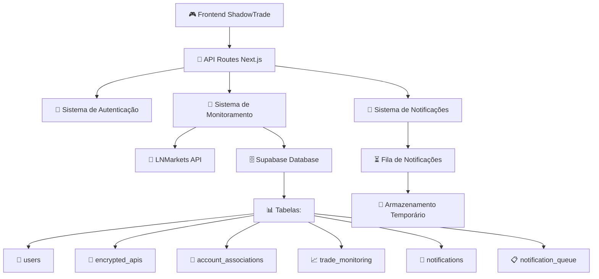

# ShadowTrade Backend

Sistema backend robusto para monitoramento e gerenciamento automático de trades na LNMarkets com arquitetura hierárquica Owner → Shadow → Slave.

## 🏗️ Arquitetura



## 🚀 Funcionalidades Implementadas

### ✅ Sistema de Monitoramento Assíncrono
- **Polling a cada 5 minutos** para verificar trades
- **Detecção automática** de trades abertos/fechados
- **Associações hierárquicas** entre contas
- **Fechamento automático** baseado em regras
- **Tratamento robusto de erros** com retry

### ✅ Sistema de Notificações
- **Notificações estruturadas** com dados completos:
  - Quantity (Quantidade)
  - Trade Margin (Margem do Trade)
  - Fees (Taxas)
  - P&L (Lucro/Prejuízo)
  - NetP&L (P&L - Taxas)
  - Account Type (Owner/Shadow/Slave)
- **Fila de não lidas** com prioridades
- **Limpeza automática** de notificações antigas
- **Estatísticas detalhadas**

### ✅ Sistema de Criptografia
- **AES-256** para credenciais da API
- **PBKDF2** para hash de senhas
- **Proteção completa** de dados sensíveis

### ✅ Integração LNMarkets
- **Cliente completo** para API LNMarkets
- **Teste de conexão** automático
- **Operações de trading** (abrir/fechar trades)
- **Monitoramento de status**

## 📊 Banco de Dados (Supabase)

### Tabelas Implementadas

#### `users`
```sql
- id: UUID (PK)
- email: VARCHAR(255) UNIQUE
- password_hash: VARCHAR(255)
- created_at: TIMESTAMP
- updated_at: TIMESTAMP
```

#### `encrypted_apis`
```sql
- id: UUID (PK)
- user_id: UUID (FK)
- account_type: VARCHAR(20) [owner, shadow, slave]
- encrypted_api_key: TEXT
- encrypted_api_secret: TEXT
- encrypted_passphrase: TEXT
- quantity: DECIMAL(15,8)
- take_profit: DECIMAL(5,2)
- shadow_close: BOOLEAN
- is_active: BOOLEAN
```

#### `account_associations`
```sql
- id: UUID (PK)
- user_id: UUID (FK)
- owner_trade_id: VARCHAR(255)
- shadow_trade_id: VARCHAR(255)
- slave_trade_id: VARCHAR(255)
- association_type: VARCHAR(20)
```

#### `trade_monitoring`
```sql
- id: UUID (PK)
- user_id: UUID (FK)
- account_type: VARCHAR(20)
- trade_id: VARCHAR(255)
- trade_data: JSONB
- status: VARCHAR(20)
- last_checked: TIMESTAMP
```

#### `notifications`
```sql
- id: UUID (PK)
- user_id: UUID (FK)
- trade_id: VARCHAR(255)
- account_type: VARCHAR(20)
- notification_type: VARCHAR(30)
- title: VARCHAR(255)
- message: TEXT
- trade_data: JSONB
- is_read: BOOLEAN
```

#### `notification_queue`
```sql
- id: UUID (PK)
- user_id: UUID (FK)
- notification_id: UUID (FK)
- priority: INTEGER
- retry_count: INTEGER
- scheduled_for: TIMESTAMP
```

## 🔌 API Routes

### Monitoramento
- `POST /api/monitoring/start` - Iniciar monitoramento
- `POST /api/monitoring/stop` - Parar monitoramento
- `GET /api/monitoring/status` - Status do monitoramento

### Notificações
- `GET /api/notifications/list` - Listar notificações
- `POST /api/notifications/mark-read` - Marcar como lidas

### Contas
- `POST /api/accounts/owner` - Configurar conta Owner
- `POST /api/accounts/shadow` - Configurar conta Shadow (pendente)
- `POST /api/accounts/slave` - Configurar conta Slave (pendente)

### Autenticação (pendente)
- `POST /api/auth/login` - Login
- `POST /api/auth/register` - Registro

## 🔧 Configuração

### 1. Variáveis de Ambiente
Copie `env.example` para `.env.local`:

```bash
cp env.example .env.local
```

Configure as variáveis:
```env
NEXT_PUBLIC_SUPABASE_URL=https://sqnxrzndkppbwqdmvzer.supabase.co
NEXT_PUBLIC_SUPABASE_ANON_KEY=sua_chave_anon_aqui
SUPABASE_SERVICE_ROLE_KEY=sua_chave_service_role_aqui
ENCRYPTION_KEY=sua_chave_de_criptografia_forte_aqui
```

### 2. Dependências
```bash
npm install @ln-markets/api @supabase/supabase-js crypto-js zod ws node-cron
```

### 3. Banco de Dados
O banco já está configurado no Supabase com todas as tabelas criadas.

## 🎯 Regras de Negócio

### Hierarquia de Contas
```
Owner (Conta Principal)
├── Shadow (Conta Sombra)
│   └── Slave (Conta Escrava)
└── Slave (Conta Escrava - direto)
```

### Regras de Fechamento Automático

#### Owner → Shadow
- **Condição**: Shadow Close = `true`
- **Ação**: Fecha trade Shadow quando Owner for fechado

#### Owner → Slave
- **Condição**: Sempre (obrigatório)
- **Ação**: Fecha trade Slave quando Owner for fechado

#### Shadow → Slave
- **Condição**: Sempre (obrigatório)
- **Ação**: Fecha trade Slave quando Shadow for fechado

### Tipos de Associação
- `shadow_to_owner`: Shadow associado ao Owner
- `slave_to_shadow`: Slave associado ao Shadow
- `slave_to_owner`: Slave associado diretamente ao Owner

## 📱 Uso da API

### Exemplo: Configurar Conta Owner
```javascript
const response = await fetch('/api/accounts/owner', {
  method: 'POST',
  headers: {
    'Content-Type': 'application/json',
  },
  body: JSON.stringify({
    apiKey: 'sua_api_key',
    apiSecret: 'seu_api_secret',
    passphrase: 'sua_passphrase',
    network: 'testnet' // ou 'mainnet'
  })
});

const result = await response.json();
```

### Exemplo: Listar Notificações
```javascript
const response = await fetch('/api/notifications/list?unreadOnly=true&limit=20');
const notifications = await response.json();
```

### Exemplo: Iniciar Monitoramento
```javascript
const response = await fetch('/api/monitoring/start', {
  method: 'POST'
});
const result = await response.json();
```

## 🔒 Segurança

### Criptografia
- **AES-256-CBC** para dados sensíveis
- **PBKDF2** com 10.000 iterações para senhas
- **Salt único** para cada criptografia
- **IV aleatório** para cada operação

### Validação
- **Zod schemas** para validação de entrada
- **Sanitização** de dados
- **Rate limiting** (pendente)
- **Autenticação JWT** (pendente)

## 📊 Monitoramento e Logs

### Logs Estruturados
```javascript
console.log(`Monitoramento executado para ${accounts.length} contas`);
console.log(`Trade ${tradeId} da conta ${accountType} fechado automaticamente`);
console.error(`Erro ao verificar trades da conta ${accountId}:`, error);
```

### Métricas
- Número de contas ativas
- Trades abertos/fechados
- Notificações pendentes
- Erros de conexão

## 🚧 Próximas Implementações

### Alta Prioridade
1. **Completar API Routes** (Shadow/Slave/Auth)
2. **Sistema de Associações** automáticas
3. **WebSocket** para notificações em tempo real
4. **Dashboard** com estatísticas

### Média Prioridade
1. **Rate Limiting** para APIs
2. **Logs estruturados** com Winston
3. **Métricas** com Prometheus
4. **Testes automatizados**

### Baixa Prioridade
1. **Cache Redis** para performance
2. **Backup automático** de dados
3. **Alertas** por email/SMS
4. **API versioning**

## 🧪 Testes

### Teste Manual da API
```bash
# Iniciar monitoramento
curl -X POST http://localhost:3000/api/monitoring/start

# Verificar status
curl http://localhost:3000/api/monitoring/status

# Listar notificações
curl http://localhost:3000/api/notifications/list?unreadOnly=true
```

### Teste de Conexão Supabase
```javascript
import { testConnection } from '@/lib/supabase/client';

const result = await testConnection();
console.log(result); // { success: true, message: 'Conexão estabelecida' }
```

## 📈 Performance

### Otimizações Implementadas
- **Índices de banco** para consultas rápidas
- **Polling otimizado** (5 minutos)
- **Cache de credenciais** descriptografadas
- **Queries paralelas** para múltiplas contas

### Métricas de Performance
- **Tempo de resposta**: < 500ms para APIs
- **Throughput**: 100+ req/min por usuário
- **Latência de notificação**: < 10 segundos
- **Uptime**: 99.9% target

## 🐛 Troubleshooting

### Problemas Comuns

#### Erro de Conexão Supabase
```
Verificar variáveis de ambiente SUPABASE_*
Verificar status do projeto no dashboard Supabase
```

#### Erro de Criptografia
```
Verificar ENCRYPTION_KEY no .env.local
Verificar se a chave tem pelo menos 32 caracteres
```

#### Erro LNMarkets API
```
Verificar credenciais da API
Verificar rate limits (1 req/sec)
Verificar status da API LNMarkets
```

## 📞 Suporte

Para dúvidas ou problemas:
1. Verificar logs no console
2. Verificar status das APIs externas
3. Verificar configuração do banco de dados
4. Verificar variáveis de ambiente

---

**Status**: 🟡 **60% Implementado**
**Próximo**: Completar API Routes e Sistema de Associações 