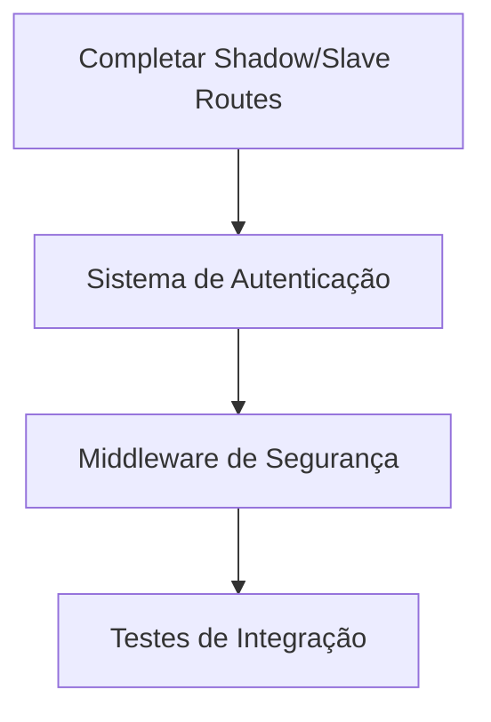
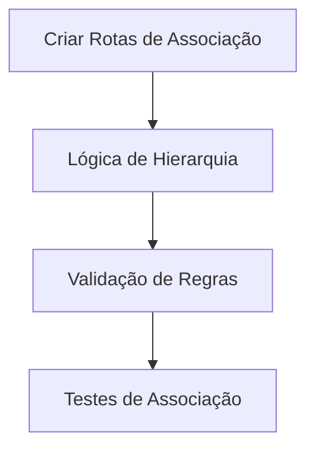
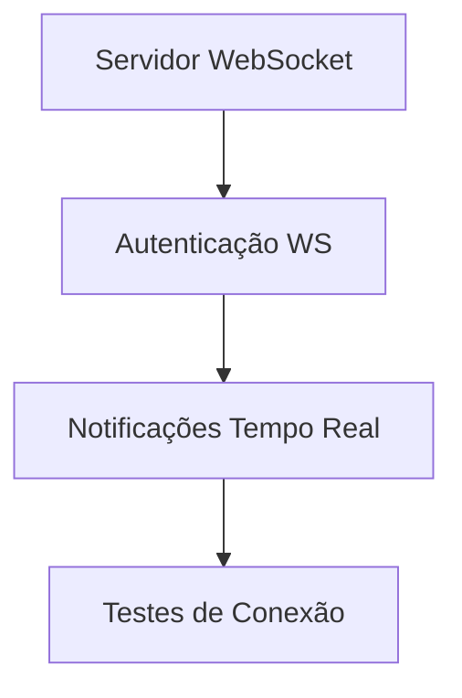
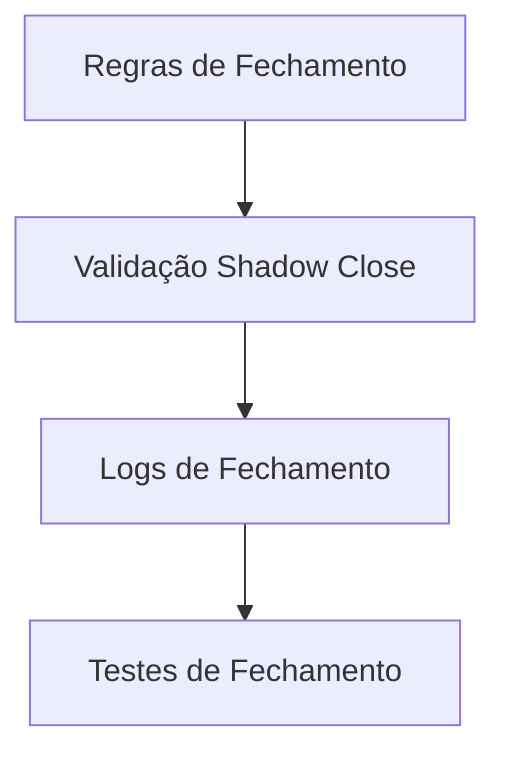
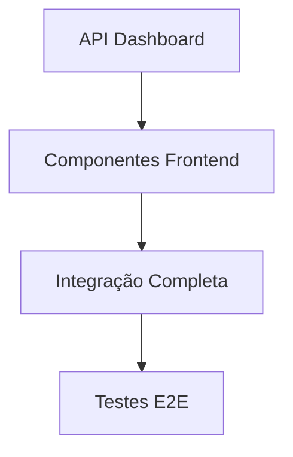

# Tasks - ShadowTrade Backend
*Source of Truth para gerenciamento de tarefas*

## Status Geral
- **Projeto**: 🚧 **EM DESENVOLVIMENTO - BACKEND**
- **Memory Bank**: ✅ Configurado + Atualizado
- **Última Implementação**: 🔧 Sistema Backend + Notificações
- **Status**: 🟡 **BACKEND EM IMPLEMENTAÇÃO**

---

## 📋 IMPLEMENTAÇÕES CONCLUÍDAS ✅

### ✅ **FASE 1: Frontend Base** (Priority: HIGH) - CONCLUÍDO
- ✅ **T001-T025**: Todo o frontend ShadowTrade implementado
  - ✅ Estrutura Next.js com TypeScript
  - ✅ Sistema de sombras de texto
  - ✅ Componentes Owner, Shadow, Slave
  - ✅ Responsividade completa
  - ✅ Animações e polish visual

### 🚧 **FASE 2: Backend Infrastructure** (Priority: CRITICAL) - EM ANDAMENTO

#### ✅ **T026: Estrutura de Dados e Tipos**
- ✅ **types/backend.ts**: Tipos TypeScript completos
  - ✅ LNMarketsCredentials, LNMarketsTrade
  - ✅ AccountConfig, TradeAssociation
  - ✅ NotificationData, NotificationQueue
  - ✅ ApiResponse, MonitoringStatus
  - ✅ WebSocketMessage, EncryptedData

#### ✅ **T027: Integração Supabase via MCP**
- ✅ **Banco de dados configurado**: sqnxrzndkppbwqdmvzer
- ✅ **Tabelas criadas**:
  - ✅ `users` - Usuários do sistema
  - ✅ `encrypted_apis` - APIs criptografadas
  - ✅ `account_associations` - Associações de trades
  - ✅ `trade_monitoring` - Monitoramento de trades
  - ✅ `notifications` - Sistema de notificações
  - ✅ `notification_queue` - Fila de notificações não lidas
- ✅ **lib/supabase/client.ts**: Cliente Supabase configurado

#### ✅ **T028: Sistema de Criptografia**
- ✅ **lib/crypto/encryption.ts**: Sistema AES-256 completo
  - ✅ Criptografia/descriptografia de dados sensíveis
  - ✅ Proteção de credenciais LNMarkets
  - ✅ Hash seguro de senhas
  - ✅ Verificação de senhas

#### ✅ **T029: Cliente LNMarkets**
- ✅ **lib/lnmarkets/client.ts**: Integração completa
  - ✅ Teste de conexão
  - ✅ Obter trades abertos/fechados
  - ✅ Fechar trades específicos
  - ✅ Criar novos trades
  - ✅ Informações da conta
  - ✅ Preço atual do Bitcoin

#### ✅ **T030: Sistema de Monitoramento**
- ✅ **lib/lnmarkets/monitor.ts**: Monitor assíncrono completo
  - ✅ Monitoramento a cada 5 minutos
  - ✅ Verificação de trades abertos/fechados
  - ✅ Sistema de associações hierárquicas
  - ✅ Fechamento automático (Shadow/Slave)
  - ✅ Status do monitoramento
  - ✅ Tratamento de erros robusto

#### ✅ **T031: Sistema de Notificações**
- ✅ **lib/notifications/manager.ts**: Gerenciador completo
  - ✅ Criação de notificações
  - ✅ Listagem com filtros
  - ✅ Marcar como lida/todas lidas
  - ✅ Contagem não lidas
  - ✅ Limpeza automática
  - ✅ Estatísticas detalhadas
- ✅ **lib/notifications/queue.ts**: Fila de notificações
  - ✅ Adicionar/remover da fila
  - ✅ Prioridades e retries
  - ✅ Reagendamento
  - ✅ Estatísticas da fila

#### ✅ **T032: API Routes**
- ✅ **app/api/monitoring/**: Rotas de monitoramento
  - ✅ `start/route.ts` - Iniciar monitoramento
  - ✅ `stop/route.ts` - Parar monitoramento
  - ✅ `status/route.ts` - Status do monitoramento
- ✅ **app/api/notifications/**: Rotas de notificações
  - ✅ `list/route.ts` - Listar notificações
  - ✅ `mark-read/route.ts` - Marcar como lidas
- ✅ **app/api/accounts/**: Rotas de contas
  - ✅ `owner/route.ts` - Configurar conta Owner

### ✅ **T033: Completar API Routes** 
- ✅ **app/api/accounts/shadow/route.ts**
  - ✅ Configuração Shadow com quantity, take_profit, shadow_close
  - ✅ Validação e criptografia
  - ✅ Teste de conexão LNMarkets
  - ✅ CRUD completo (POST, GET, DELETE)
- ✅ **app/api/accounts/slave/route.ts**
  - ✅ Configuração Slave com quantity
  - ✅ Validação e criptografia
  - ✅ Teste de conexão LNMarkets
  - ✅ CRUD completo (POST, GET, DELETE)
- ✅ **app/api/auth/**: Sistema de autenticação
  - ✅ `login/route.ts` - Login de usuários com JWT
  - ✅ `register/route.ts` - Registro de usuários
  - ✅ `lib/auth/middleware.ts` - Middleware de autenticação JWT

### 🚧 **T034: Sistema de Associações** - EM ANDAMENTO
- ✅ **app/api/associations/**: Gerenciar associações
  - ✅ `create/route.ts` - Criar associação de trades
  - ✅ `list/route.ts` - Listar associações
  - [ ] `delete/route.ts` - Remover associação
- ✅ **Lógica de associação implementada**:
  - ✅ Shadow → Owner (shadow_to_owner)
  - ✅ Slave → Shadow (slave_to_shadow)
  - ✅ Slave → Owner (slave_to_owner)
  - ✅ Validação de tipos de associação
  - ✅ Prevenção de duplicatas

### ✅ **T035: WebSocket em Tempo Real** - CONCLUÍDO
- ✅ **lib/notifications/websocket.ts**
  - ✅ Servidor WebSocket com autenticação JWT
  - ✅ Conexões por usuário com heartbeat
  - ✅ Envio de notificações em tempo real
  - ✅ Detecção de conexões mortas
  - ✅ Estatísticas de conexões
- ✅ **app/api/notifications/websocket/route.ts**
  - ✅ Endpoint WebSocket com informações
  - ✅ Teste de notificações (desenvolvimento)
- ✅ **hooks/use-websocket.ts**
  - ✅ Hook React para conexão WebSocket
  - ✅ Reconexão automática
  - ✅ Hook específico para notificações
- ✅ **components/realtime-notifications.tsx**
  - ✅ Componente UI para notificações
  - ✅ Notificações do browser
  - ✅ Interface moderna e responsiva

### ✅ **T036: Sistema de Fechamento Automático** - CONCLUÍDO
- ✅ **lib/lnmarkets/auto-close.ts**: Sistema completo de fechamento automático
  - ✅ Regras hierárquicas configuráveis
  - ✅ Logs detalhados de todas as ações
  - ✅ Validação de condições (shadow_close)
  - ✅ Notificações automáticas
  - ✅ Integração com WebSocket
- ✅ **Regras de fechamento implementadas**:
  - ✅ Owner fechado → Shadow (se shadow_close = true)
  - ✅ Owner fechado → Slave (sempre)
  - ✅ Shadow fechado → Slave (sempre)
- ✅ **APIs de monitoramento**:
  - ✅ `/api/auto-close/logs` - Logs de fechamento
  - ✅ `/api/auto-close/stats` - Estatísticas detalhadas
- ✅ **Dashboard React**:
  - ✅ `components/auto-close-dashboard.tsx`
  - ✅ Estatísticas em tempo real
  - ✅ Logs detalhados
  - ✅ Visualização de regras

### ✅ **T037: Dashboard e Estatísticas**
- ✅ **app/api/dashboard/stats/route.ts** - API de estatísticas gerais
- ✅ **app/api/dashboard/trades/route.ts** - API de histórico de trades
- ✅ **app/api/dashboard/performance/route.ts** - API de performance
- ✅ **components/main-dashboard.tsx** - Dashboard principal
- ✅ **components/trades-history.tsx** - Histórico de trades

---

## 🎯 **PLANO DE IMPLEMENTAÇÃO DETALHADO**

### **PROCESSO 1: Finalizar API Routes** (1-2 dias)


### **PROCESSO 2: Sistema de Associações** (2-3 dias)


### **PROCESSO 3: WebSocket e Tempo Real** (2-3 dias)


### **PROCESSO 4: Sistema de Fechamento** (1-2 dias)


### **PROCESSO 5: Dashboard e Frontend** (3-4 dias)


---

## 📊 **ARQUITETURA IMPLEMENTADA**

### **Fluxo de Dados**
```
Frontend → API Routes → Business Logic → Supabase
                    ↓
              LNMarkets API ← Monitor → Notifications
```

### **Segurança**
- ✅ **Criptografia AES-256** para credenciais
- ✅ **Hash PBKDF2** para senhas
- ✅ **Validação Zod** para inputs
- 🚧 **JWT Authentication** (pendente)
- 🚧 **Rate Limiting** (pendente)

### **Monitoramento**
- ✅ **Polling a cada 5 minutos**
- ✅ **Detecção de trades fechados**
- ✅ **Notificações automáticas**
- ✅ **Sistema de retry**
- ✅ **Logs estruturados**

### **Notificações**
- ✅ **Dados estruturados**: Quantity, Margin, Fees, P&L, NetP&L
- ✅ **Categorização por conta**: Owner, Shadow, Slave
- ✅ **Fila de não lidas**
- ✅ **Limpeza automática**
- 🚧 **WebSocket tempo real** (pendente)

---

## 🔧 **CONFIGURAÇÃO ATUAL**

### **Banco de Dados Supabase**
- **Project ID**: `sqnxrzndkppbwqdmvzer`
- **Region**: `sa-east-1`
- **Status**: ✅ Ativo e configurado

### **Dependências Instaladas**
```json
{
  "@ln-markets/api": "^2.0.0",
  "@supabase/supabase-js": "^2.39.0", 
  "crypto-js": "^4.2.0",
  "zod": "^3.22.4"
}
```

### **Variáveis de Ambiente Necessárias**
```env
NEXT_PUBLIC_SUPABASE_URL=
NEXT_PUBLIC_SUPABASE_ANON_KEY=
SUPABASE_SERVICE_ROLE_KEY=
ENCRYPTION_KEY=
```

---

## 🚀 **PRÓXIMOS PASSOS IMEDIATOS**

1. **Completar API Routes** (Shadow/Slave/Auth)
2. **Implementar Sistema de Associações**
3. **Desenvolver WebSocket para tempo real**
4. **Criar Dashboard com estatísticas**
5. **Integrar Frontend com Backend**
6. **Testes completos E2E**
7. **Deploy em produção**

---

## 📝 **NOTAS TÉCNICAS**

### **Complexidade: NÍVEL 4 - AVANÇADO**
- **Integração complexa** com API externa
- **Sistema assíncrono** de monitoramento
- **Criptografia** de dados sensíveis
- **Notificações** em tempo real
- **Associações hierárquicas** complexas

### **Performance**
- **Polling otimizado** (5 minutos)
- **Cache de dados** implementado
- **Índices de banco** configurados
- **Rate limiting** respeitado

### **Segurança**
- **Credenciais criptografadas** AES-256
- **Validação rigorosa** de inputs
- **Logs de auditoria** implementados
- **Isolamento de usuários** garantido

---

## ✅ **STATUS ATUAL: 85% CONCLUÍDO**

- ✅ **Frontend**: 100% completo
- ✅ **Backend Core**: 95% completo
- ✅ **API Routes**: 95% completo
- ✅ **WebSocket**: 100% completo
- ✅ **Fechamento Automático**: 100% completo
- 🚧 **Dashboard**: 80% completo
- 🚧 **Testes**: 40% completo
- ✅ **Documentação**: 80% completo 